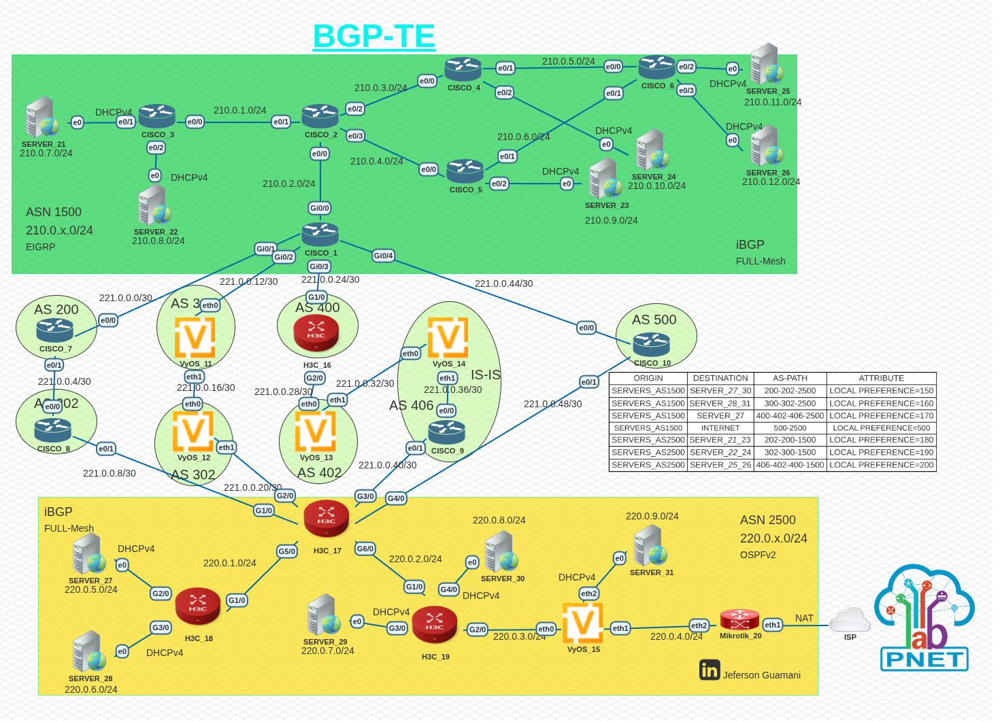
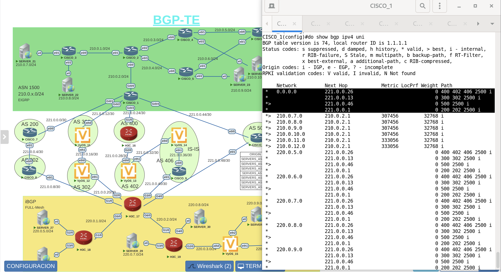
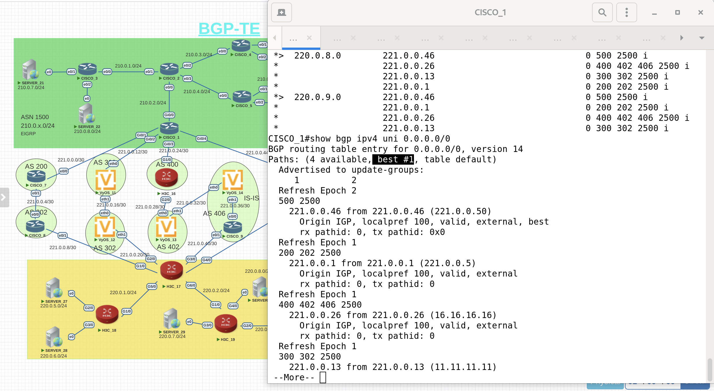
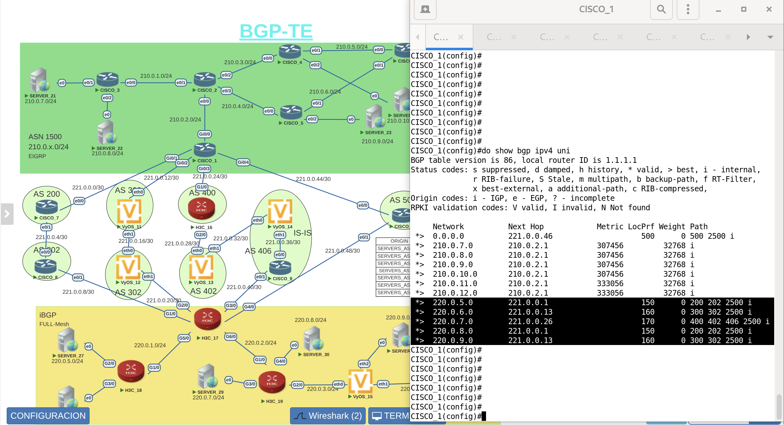
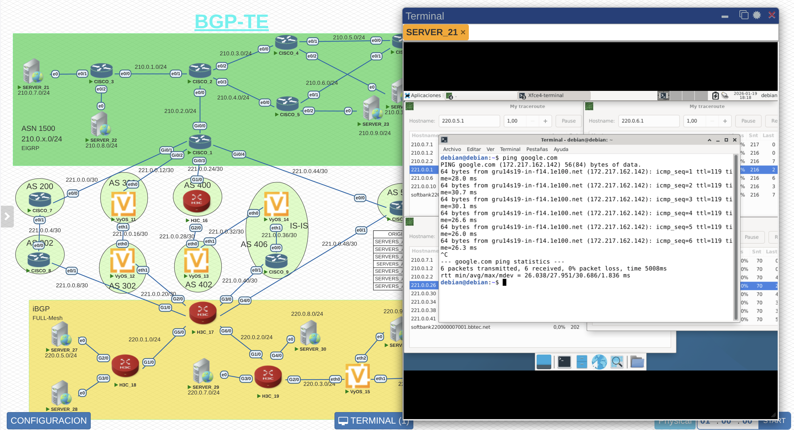

# BGP_TE_IPv4
## Topología del laboratorio

## Tabla de enrutamiento BGP 

###Se puede observar las 4 rutas desde el AS 1500 hacia el AS 2500 o Internet

## RUTA SELECCIONADA A INTERNET

###La menor ruta seleccionada en base a que los atributos estan por defecto es decir no han sido alterados por lo cual la seleccionada es la que posee el menor as-path

## ATRIBUTO BGP LOCAL-PREFERENCE MODIFICADO EN CISCO_1

## ATRIBUTO BGP LOCAL-PREFERENCE MODIFICADO EN H3C_!7

## PRUEBA DE CONECTIVIDAD Y VERIFICACION DE RUTAS

###Mediante el comando mtr se puede verificar la ruta que es seleccionada dependiendo el destino y en la cual se puede observar que dependiendo el destino selecciona el siguiente salto especificado mediante el atributo local preference

## PRUEBA DE CONECTIVIDAD Y RESOLCUION DNS

Mediante el comando ping se vertifica conectividad a internet y mediante el ping al dominio y no la ip se observa que si existe una correcta resolucion de dominio 
