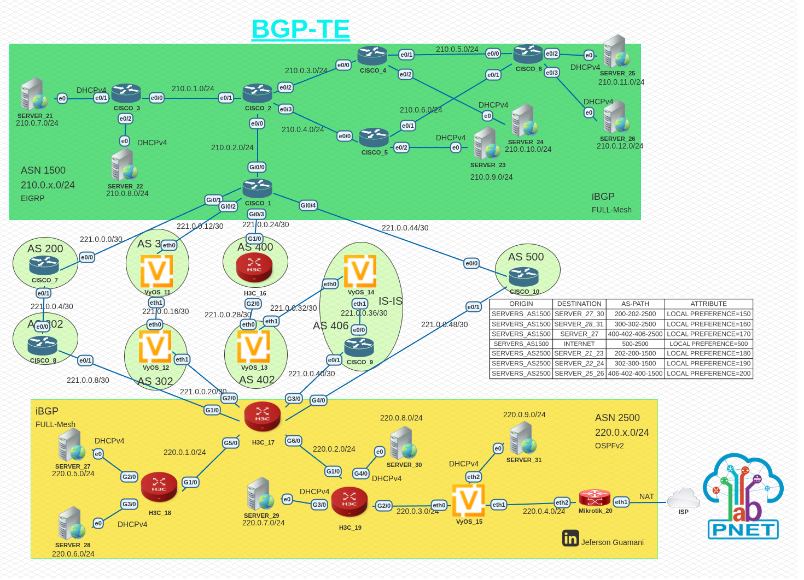
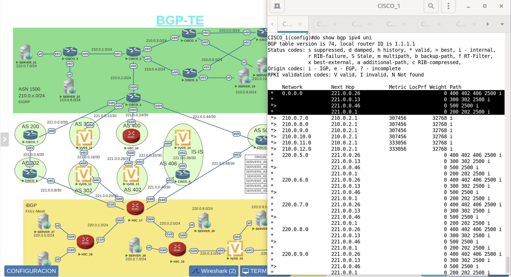
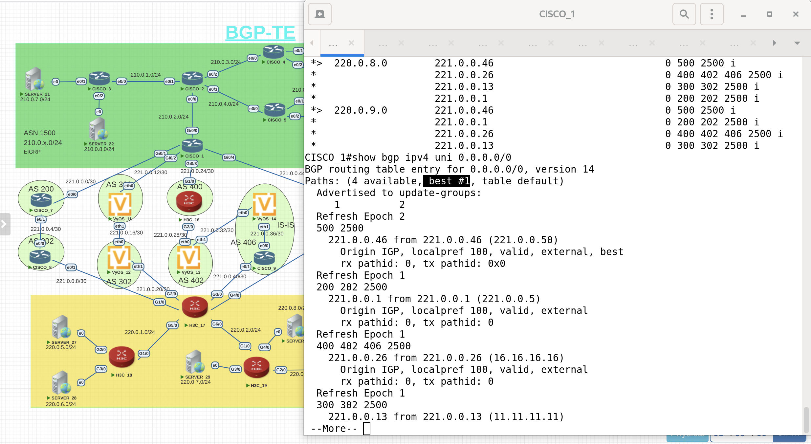
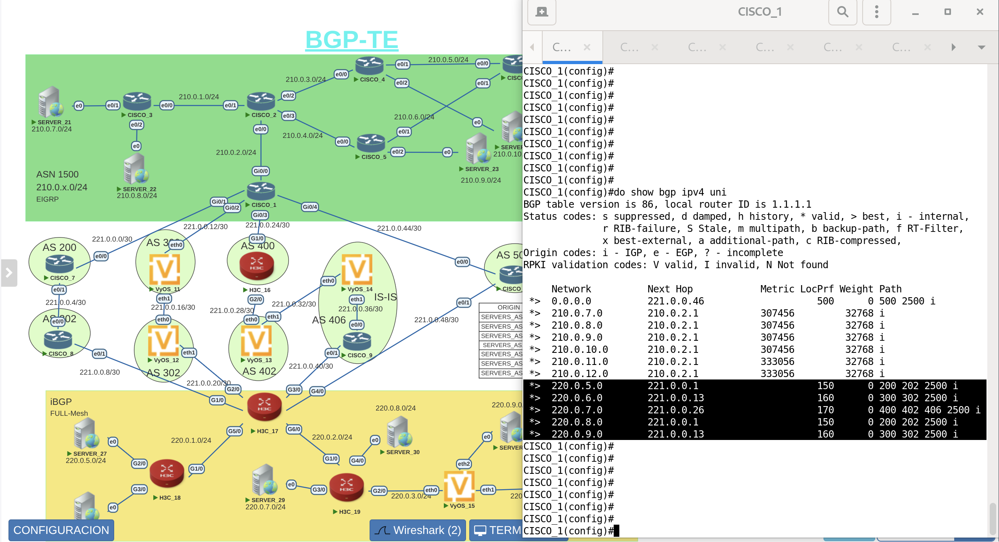
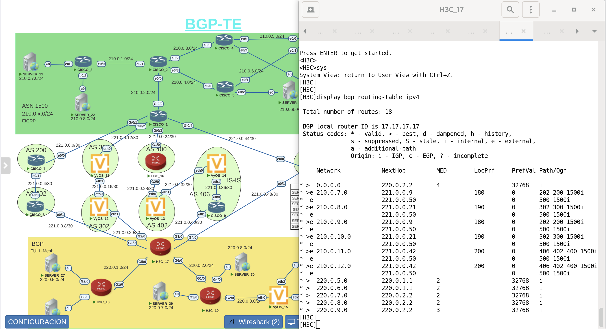
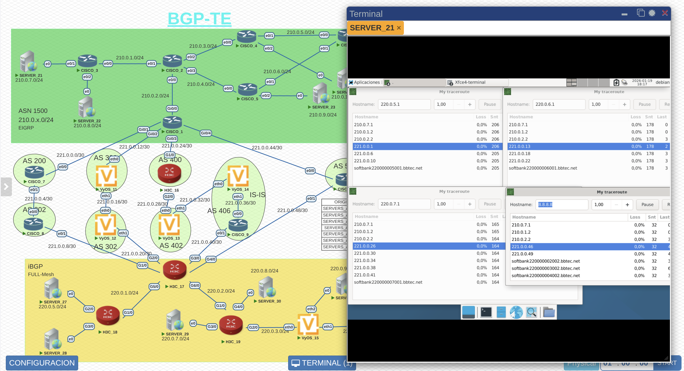
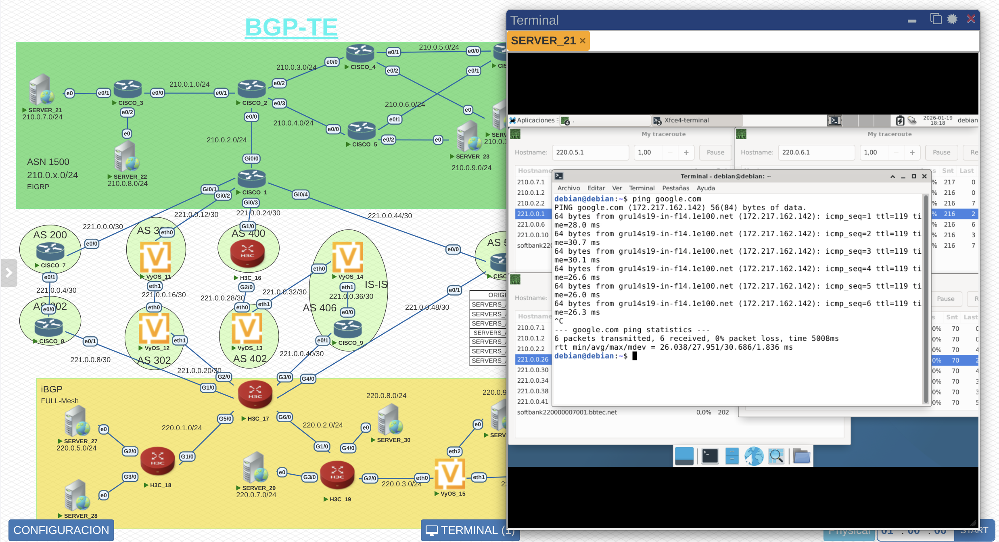

# BGP_TE_IPv4

Comparto un nuevo escenario de laboratorio centrado en la ingeniería de tráfico BGP en IPv4, integrando múltiples protocolos IGP y un entorno multi-AS y multivendedor.
En este caso, el objetivo era controlar la selección de rutas BGP mediante el atributo de Preferencia Local, aplicando políticas directamente a equipos Cisco y H3C, simulando un entorno empresarial real.

## Topología del laboratorio

🏗 Tecnologías Implementadas

🌐 IPv4

🔁 EIGRP

🔁 OSPFv2

🔁 IS-IS

🔁 DHCPv4

📡 BGP (eBGP + iBGP Full Mesh)

🧠 Ingeniería de Tráfico BGP - Preferencia Local

🔐 NAT

🧩 Entorno multivendedor (Cisco, H3C, VyOS, MikroTik)

## Tabla de enrutamiento BGP 

Se puede observar las 4 rutas desde el AS 1500 hacia el AS 2500 o Internet

## RUTA SELECCIONADA A INTERNET

La menor ruta seleccionada en base a que los atributos estan por defecto es decir no han sido alterados por lo cual la seleccionada es la que posee el menor as-path

## ATRIBUTO BGP LOCAL-PREFERENCE MODIFICADO EN CISCO_1

## ATRIBUTO BGP LOCAL-PREFERENCE MODIFICADO EN H3C_!7

## PRUEBA DE CONECTIVIDAD Y VERIFICACION DE RUTAS

Mediante el comando mtr se puede verificar la ruta que es seleccionada dependiendo el destino y en la cual se puede observar que dependiendo el destino selecciona el siguiente salto especificado mediante el atributo local preference

## PRUEBA DE CONECTIVIDAD Y RESOLCUION DNS

Mediante el comando ping se vertifica conectividad a internet y mediante el ping al dominio y no la ip se observa que si existe una correcta resolucion de dominio 
